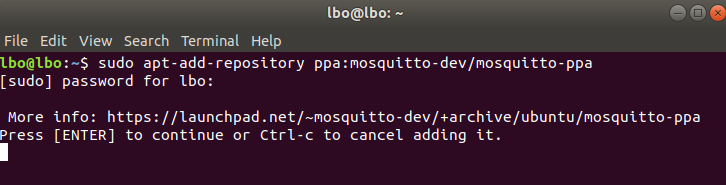
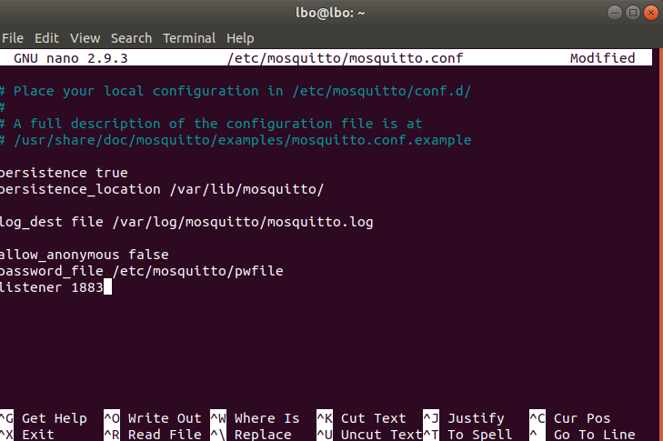
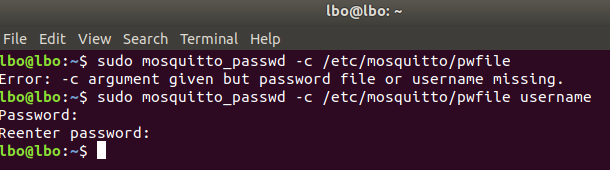
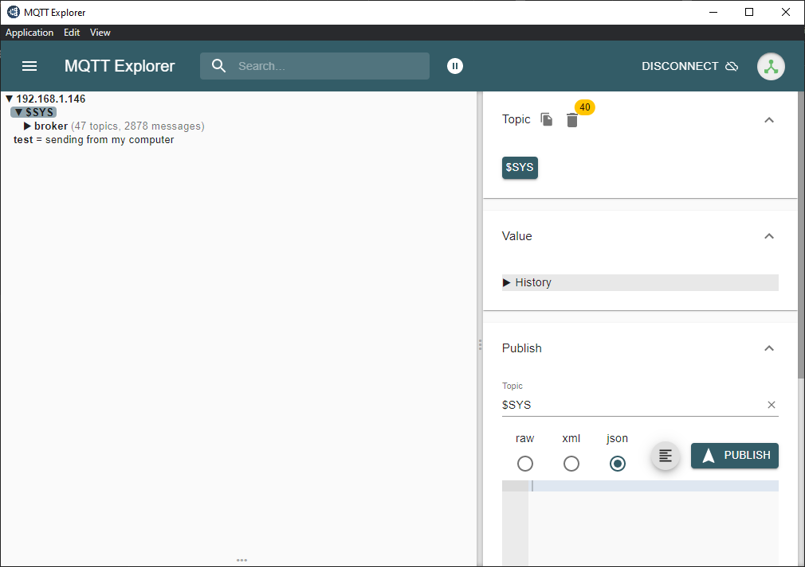
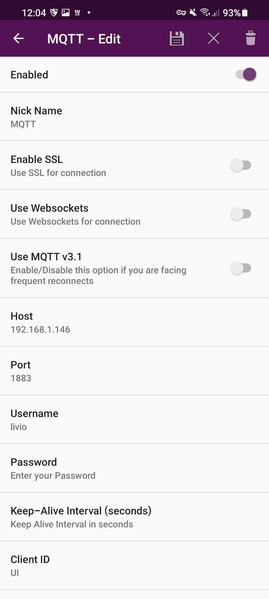
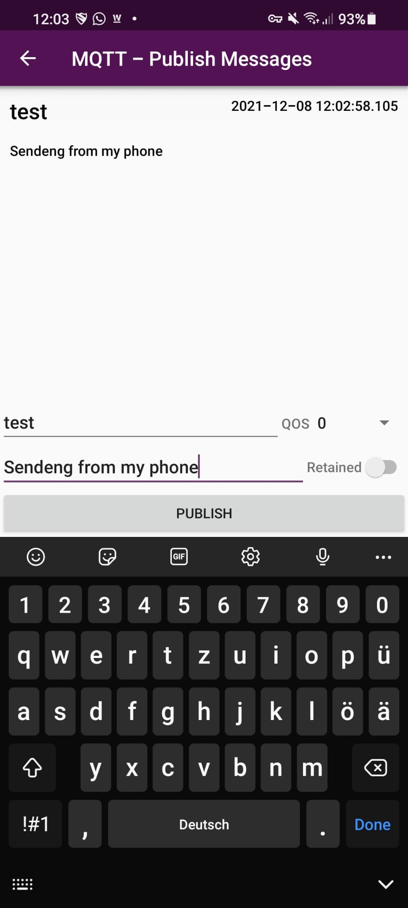
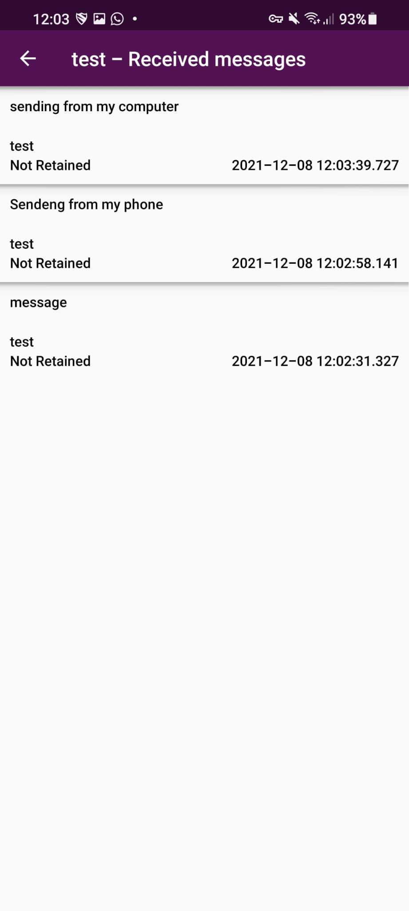
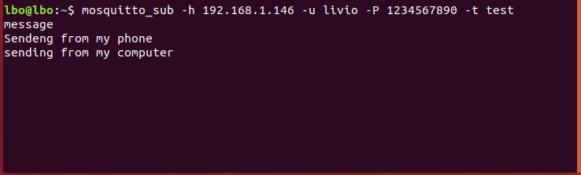

# M242 - Mikroprozessoranwendungen realisieren

## LB3 IoTKit

Folgend erbringe ich meine Leistungsnachweise für die Lernbeurteilung 3 des Modul 242. 

# Inhaltsverzeichnis
- [K1](#K1)
- [K2](#K2)
- [K3](#K3)
- [K4](#K4)
- [K5](#K5)
- [K6](#K6)

## K1
Umbebung auf eigenem Notebook eingerichtet und funktionsfähig 
[1. Account auf os.mbed.com erstellt](#1-Account-auf-os.mbed.com-erstellt)  
[2. Serial Driver installiert](#2-Serial-Driver-installiert) 
[3. Terminal Programm installiert](#3-Terminal-Programm-installiert) 

### 1. Account auf os.mbed.com erstellt

Nach Anleitung des Lehrers installiert und ausgeführt.

Anleitung: https://github.com/iotkitv3

### 2. Serial Driver installiert

Nach Anleitung des Lehrers installiert und ausgeführt.

Anleitung: https://github.com/iotkitv3

### 3. Terminal Programm installiert

Nach Anleitung des Lehrers installiert und ausgeführt.

Anleitung: https://github.com/iotkitv3

## K2
Eigene Lernumgebung ist eingerichtet 
[1. Dokumentation ist vorhanden](#1-dokumentation-ist-vorhanden) 
[2. Persönlicher Wissenstand](#2-persönlicher-wissenstand) 
[3. Wichtige Lernschritte sind dokumentiert](#3-wichtige-lernschritte-sind-dokumentiert)
[4. Wichtige Lernschritte sind dokumentiert](#4-Anhand-der-Dokumentation-können-Dritte-das-Projekt-nachbauen)

### 1. Dokumentation ist vorhanden

GitHub Account: https://github.com/liviobortolin

Ich habe während dieser Arbeit Github-Desktop verwendet. Somit konnte ich alle commit, push, fetch und pull Befehle über ein UI erstellen.

### 2. Persönlicher Wissenstand

Anbei dokumentiere ich meinen Wissenstand und definiere meinen Fortschritt.

#### Tag 1 27.10.21

Heute haben wir mit dem Modul 242 angefangen. Wir haben unser Gerät mit den nötigsten Softwares installiert. 
Diese Tools haben wir installiert: Mbed, MQTT Explorer und eine einen Hypervisor.

Zusätzlicher Wissenstand in folgenden Schwerpunkten: 
Es war für mich eine herausforderung mich mit diesm Thema auseinanderzusetzen. Doch ich bin zuversichtig, dass ich einiges Lernen werde.

##### IoT

-nutzt Aktoren und Sensoren
-ICT Protokol

##### Sensoren

-nimmt Umgebung war und
-fasst Umebung zusammen

##### Aktoren

-Das Resultat der Sonsorig
-Hier werden die Sensoren umgesetzt

##### Service

-verschiedene Diensten kennengelernt, die relevant sind für diese Modul.

#### Tag 2 10.11.21

Heute habe ich ich vertieft mit dem HTTP Modul auseinandergesetzt

Zusätzlicher Wissenstand in folgenden Schwerpunkten: 
Es war für mich eine herausforderung mich mit diesm Thema auseinanderzusetzen. Doch ich bin zuversichtig, dass ich einiges Lernen werde.

##### IoT

-Internes Nerzwerk aufbauen

##### Sensoren

-nichts neues

##### Aktoren

-nichts neues

##### Service

-HTTP 

#### Tag 3 24.11.2021

Heute habe das Modul beendet in dem ich alles nochmals anschauen musst um auch die LB1 zu schreiben.

Zusätzlicher Wissenstand in folgenden Schwerpunkten: 
Es war für mich eine herausforderung mich mit diesm Thema auseinanderzusetzen. Doch ich bin zuversichtig, dass ich einiges Lernen werde.

##### IoT

-Internes Nerzwerk aufbauen

##### Sensoren

-nichts neues

##### Aktoren

-nichts neues

##### Service

-Brocker mit Mosquitto

#### Tag 3 08.12.2021

Heute habe ich ich vertieft mit dem Brocker Mosquitto auseinandergesetzt.

Zusätzlicher Wissenstand in folgenden Schwerpunkten: 
Es war für mich eine herausforderung mich mit diesm Thema auseinanderzusetzen. Doch ich bin zuversichtig, dass ich einiges Lernen werde.

##### IoT

-Internes Nerzwerk aufbauen

##### Sensoren

-nichts neues

##### Aktoren

-nichts neues

##### Service

-Brocker mit Mosquitto

### 3. Wichtige Lernschritte sind dokumentiert

Die Vorteile der Microservices sind:

- Es enthaltet mehr über als die CPU
- Es ist Kostengünstig
- Es dient dazu, Gegenstände ins Netzwerk zu integrieren

### Microservices
Microservices sind ein Architekturkonzept der Anwendungsentwicklung. Ein Microservice ist also eine Kernfunktion einer Anwendung und er wird unabhängig von anderen Services ausgeführt.

Jede Funktion kann unabhängig entwickelt und implementiert werden.

### 4. Anhand der Dokumentation können Dritte das Projekt nachbauen

Siehe Arbeitsschritte in Kriterium - [4](#K4)

## K3 IoTKit
[1. Beispiel Programm verwendet](#1-Beispiel-Programm-verwendet) 
[2. Beispiel Programm geringfügig abgeän-dert, z.B. nur URL](#2-Beispiel-Programm-geringfügig-abgeändert,-z.B.-nur-URL) 
[3. Beispiel Programm erweitert, z.B. mehr Sensordaten senden oder andere Daten.](#3-Beispiel-Programm-erweitert,-z.B.-mehr-Sensordaten-senden-oder-andere-Daten.) 

### 1. Beispiel Programm verwendet

Siehe - [Gtthub von Denis Sabotic](https://github.com/saboticdenis/M242_http)

### 2. Beispiel Programm geringfügig abgeän-dert, z.B. nur URL

Siehe - [Gtthub von Denis Sabotic](https://github.com/saboticdenis/M242_http)

### 3. Beispiel Programm erweitert, z.B. mehr Sensordaten senden oder andere Daten.

Siehe - [Gtthub von Denis Sabotic](https://github.com/saboticdenis/M242_http)

## K4 Gateway / Edge
[1. Eigenen Gateway/Edge aufgesetzt (Rasp-berry Pi, VMs etc.)](#1-Eigenen-Gateway/Edge-aufgesetzt-(Rasp-berry-Pi,-VMs-etc.)) 
[2. Gateway Dienst installiert, z.B. MQTT Bro-ker mosquitto](#2-Gateway-Dienst-installiert,-z.B.-MQTT-Bro-ker-mosquitto) 
[3. Weiteren Gateway / Protokoll Dienst instal-liert und funktionsfähig](#3-Weiteren-Gateway-/-Protokoll-Dienst-installiert-und-funktionsfähig)

### 1.Eigenen Gateway/Edge aufgesetzt (Rasp-berry Pi, VMs etc.)

Ich kreire eine normale Linux Ubuntu VM auf VMworkstation Pro. wichtig dabei, dass die Netzwerk konfiguration auf Bridged gesetzt ist:

### 2.Gateway Dienst installiert, z.B. MQTT Bro-ker mosquitto

Mosquitto installieren undkonfigurieren:

Zudem habe ich zur Sicherheit noch ein Benutzername mit Password erstellt. Um die authentifikation zu gewährleisten:

## 3.Weiteren Gateway / Protokoll Dienst instal-liert und funktionsfähig

MQTT in Netzwerk integriert, so dass auch externe Geräte darauf Zugreiffen können. Siehe Explorer

Smartphone konfiguriert, um mit einem Handy auf den Broker Zugreiffen zu können:

Logs auf dem Cmputer aufgezeichnet:

Anstatt ein Programm zu erweitern haben wir uns dazu entschieden einen eigenen Service zu entwicklen. Hierfür müssen folgende Funktionalitäten im Programm für den Mikroprozessor implementiert werden:
• Aktuelle Zeit holen
• Wiederholtes senden der aktuellen Daten
• HTTPS POST Request
◦ Auth-Token Header
◦ Temperatur
◦ Gerätename
◦ Aktuelle Temperatur
• Response Handling
◦ Zusätzlicher Text bei Fehlern
◦ LED an- und ausschalten je nach Fehler
Hier haben wir als erstes damit angefangen einen HTTPS Request auszuführen.
Hierfür haben wir die mbed-http library verwendet.
Um dies zu testen haben wir folgenden Code verwendet:

## K5 (Cloud) Dienst
[1. (Cloud) Dienst aus den Beispielen verwen-det](#1-(Cloud)-Dienst-aus-den-Beispielen-verwen-det) 
[2. Neuen, welcher nicht in den Beispielen vorkommt, Dienst verwendet](#2-Neuen,-welcher-nicht-in-den-Beispielen-vorkommt,-Dienst-verwendet) 
[3. Eigenen (Cloud) Dienst implementiert](#3-Eigenen-(Cloud)-Dienst-implementiert) 

### 1. (Cloud) Dienst aus den Beispielen verwen-det

### 2. Neuen, welcher nicht in den Beispielen vorkommt, Dienst verwendet

### 3. Eigenen (Cloud) Dienst implementiert

## K6 Zusätzliche Bewertungspunkte
[1. Allgemein (Kreativität, Komplexität, Um-fang)](#1-Allgemein-(Kreativität,-Komplexität,-Um-fang)) 
[2. Umsetzung eigener Ideen](#2-Umsetzung-eigener-Ideen) 
[3. Persönlicher Lernentwicklung (Vergleich Vorwissen – Wissenszuwachs)](#3-Persönlicher-Lernentwicklung-(Vergleich-Vorwissen–Wissenszuwachs)) 
[4. Reflexion](#4-Reflexion) 

### 1. Allgemein (Kreativität, Komplexität, Um-fang

Sowohl unser Projekt, wie auch diese Dokumentation habe ich umfangreich gelöst.

Ich denke die Kreativität hätte mehr lauf finden könne, wenn wir mehr Zeit in der Schule hätten.

### 2. Umsetzung eigener Ideen

Smartphone umsetzung [4](#K4)

### 3. Persönlicher Lernentwicklung (Vergleich Vorwissen – Wissenszuwachs

Bisher habe ich IoT-Geräte, insbesondere MCUs, nicht angefasst. Ich habe den Raspberry Pi einmal in einem anderen Modul verwendet. Aber das ist es. Ich nutze täglich verschiedene IoT-Geräte im Bereich Smart Home. Bei Cloud-Diensten muss ich häufiger beraten.

### 4. Reflexion

Ich denke, meine Arbeit an dem Modul ist insgesamt gut vorangekommen, aber vielleicht sollte ich die Bewertungskriterien früher überprüfen, weil ich gemerkt habe, dass ich nicht viel von dem aufgenommen habe, was wir aufnehmen sollten. So viele Dinge mussten wir zweimal machen, weil wir sie nicht aufgenommen haben. Ansonsten haben wir sehr gut zusammengearbeitet und gute Fortschritte gemacht